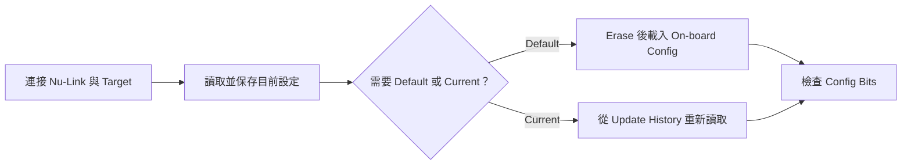
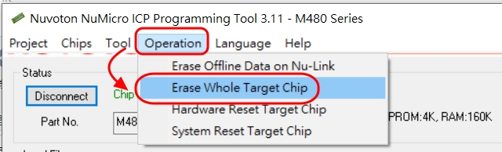
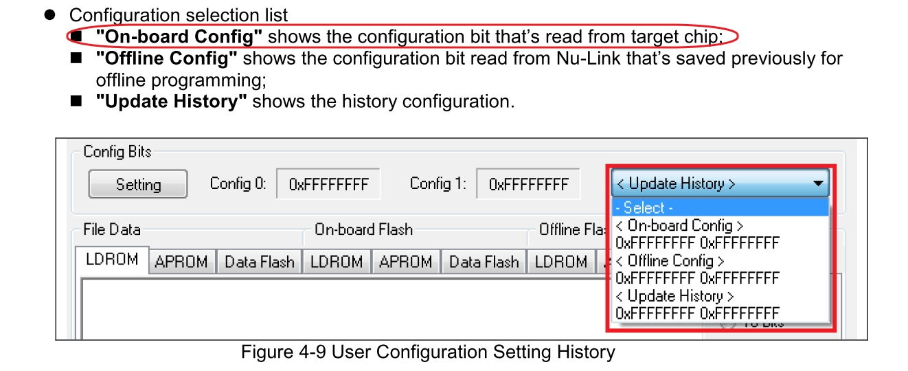
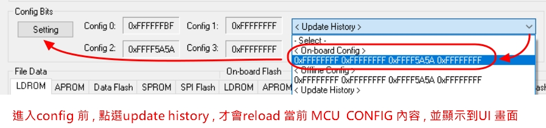
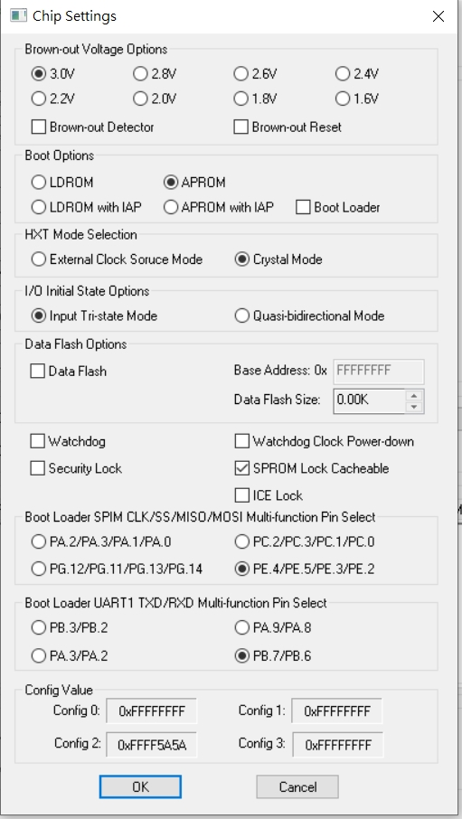
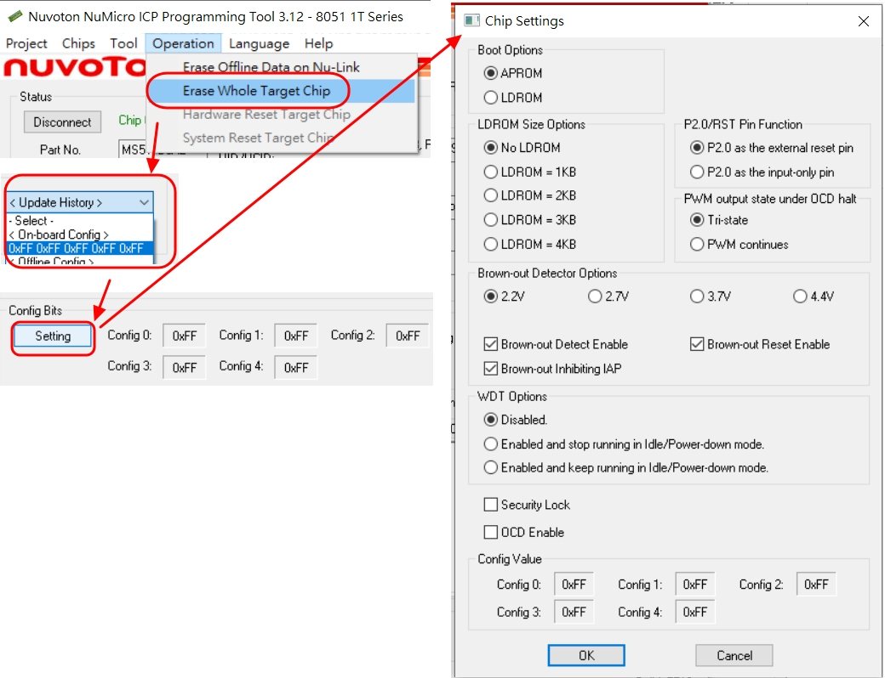

[回到知識庫總索引](https://released.github.io/)

# FAQ (Nuvoton)

> 以 Nuvoton ICP Programming Tool 為主，說明如何重新載入 MCU 的預設或目前 Config Bits。寫入前請先保存現有設定，並確認 erase 動作是否會清除 APROM、LDROM 或 Data Flash。

## Config Bits 操作流程

* [MCU default config](#default_config)

* [MCU current config](#current_config)

---

# How to reload DEFAULT config from MCU by using ICP tool

* __step 1 : erase MCU flash__

* __step 2 : by select On-board Config under Update History , to reload config from MCU__

* __step 3 : Select Config Bits Setting , will display default config setting__

[back to top](#article_top)   

---

# How to reload CURRENT config from MCU by using ICP tool

* __step 1 : by select On-board Config under Update History , to reload config from MCU__

* __step 2 : Select Config Bits Setting , will display default config setting__

[back to top](#article_top)   

---

